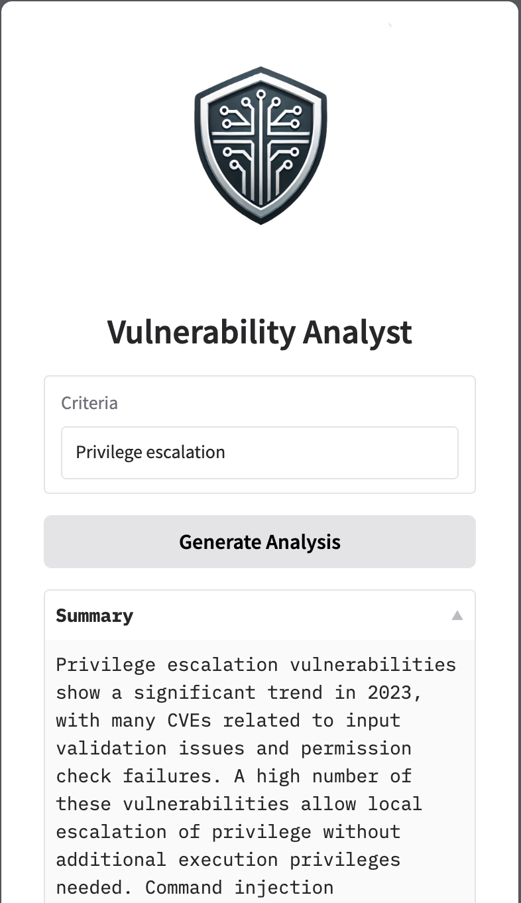

# Vulnerability Analyst - RAG LLM UI and API Scaffold

## Overview

This project integrates **FastAPI**, **AWS Cognito**, **DynamoDB**, **Gradio**, and **AWS Bedrock** to provide a user interface and API for interacting with a Large Language Model (LLM) deployed on AWS Bedrock platform.

### Purpose

The purpose of this application is to demonstrate how modern AI and cloud technologies can be combined to create a user-friendly and intelligent AI web interface and REST API, with security in mind.

### Vulnerability Analyst

The specific use case for this project is a **Vulnerability Analyst**, which assists users in generating analysis for historically reported vulnerabilities based on a CVEs. By leveraging an LLM hosted on AWS Bedrock, the application can generate insights that help learning about past vulnerabilities in an interesting manner.



The Vulnerability Analyst is designed to help developers, security engineers, and IT administrators by providing contextualized and detailed CVE analysis and trends. The workflow is as follows:

1. **Criteria Input**: Users provide a criteria and other contextual information, such as product, vendor, category, etc.
2. **LLM Analysis**: The system uses an LLM to analyze the input and generate analysis according to the supplied data.
3. **Interactive Interface**: Users interact with the system through a Gradio-powered interface to input their data and view analysis in real-time.

## Features

- **User Authentication**: Powered by AWS Cognito, users can securely log in to both the FastAPI API and the Gradio interface.
- **AWS Bedrock Integration**: The application sends relevant prompts to AWS Bedrock using the appropriate `langchain` libraries.
- **Gradio Interface**: A user-friendly interface built with Gradio that interacts with the FastAPI backend and LLM.
- **FastAPI Endpoints**: A robust API interface that handles authenticated requests, LLM interactions, and integrates with Gradio for enhanced functionality.
- **Containerization**: The application can be easily containerized using Docker for scalable deployment.

## Prerequisites

- **Python 3.10**
- **Poetry** for dependency management
- **AWS Account** with Cognito User Pool configured for user login and Amazon Bedrock configured for LLM access
- **Docker** (optional, for containerization)

## Installation

1. **Clone the repository**:
   ```bash
   git clone <repository-url>
   cd <repository-directory>
   ```

2. **Install dependencies** using Poetry:
   ```bash
   poetry install
   ```

3. **Configure AWS Cognito and Bedrock**:
   - Set up a Cognito User Pool and App Client in your AWS account.
   - Set up AWS Bedrock with the appropriate LLM model for analyzing vulnerabilities and generating analysis.
   - Note down the User Pool ID, App Client ID, and Bedrock configuration details, which will be used in the environment configuration.

4. **Set up environment variables**:
   Create a `.env` file in the root directory with the following variables:
   ```bash
   MOTO=<True-for-development-and-testing>
   MODEL_SOURCE=<Bedrock>
   SECRET_KEY=<secure-random-key>
   COGNITO_REGION=<your-user-pool-region>
   COGNITO_USER_POOL_ID=<your-user-pool-id>
   COGNITO_APP_CLIENT_ID=<your-app-client-id>
   BEDROCK_MODEL_ID=<your-bedrock-model-id>
   LOG_LEVEL=<application-logging-level>
   ```

   If you're using one of the helper scripts to provision your environment, such as `scripts/init_backend.py`, it would provision the `.env` file automatically for you.

## Running the Application

### Data Preperation

The application queries the local `Redis` stack, which for the project purposes deployed on a local docker container. You first need to provision the local `Redis` container by running the following command:

```bash
docker compose up -d
```

After the `Redis` container is ready to accept new connections, we need to index the CVEs (`data/allitems.csv`) into the vector database. This is done by running the helper script `scripts/init_cve_db.py`:

```bash
poetry run python scripts/init_cve_db.py
```

By default, the script cleans the original `data/allitems.csv` file provided by MITRE, and ingests CVEs from 2023 and 2024. This alone could take around 3-5 hours, depends on your computer resources. While the script is ingesting the CVEs, you can open a seperate tab and run the application in order to start analysing trends from the available data.

### Running Locally

To run the FastAPI application locally, make sure to provision the `Redis` vector database that holds both the embeddings and the llm cache, then run the python application.

```bash
docker compose up -d
poetry run python app.py
```

Access the API documentation at `http://localhost:8000/docs`.

### Docker

To run the application using Docker:

```bash
docker build -t <image-name> .
docker run -p 8000:8000 <image-name>
```

## Usage

1. **Log in via Gradio**: Users can access the Gradio interface and log in using their Cognito user credentials.
2. **Enter Input Field**: The user enters the required criteria such as product, vendor, category, etc.
3. **Receive Analysis**: Based on the user-provided data, the LLM generates analysis.

### FastAPI Endpoints

- `POST /api/v1/signin`: Authenticate using Cognito credentials, get a JWT in response (When using `MOTO` mode for testing / development, username is the user name provided from the `init_backend.py --moto` script log).
- `POST /api/v1/vulnerability-analyst/generate`: Enter the related parameters and receive a JSON with analysis.

### Gradio Interface

The Gradio interface is available at `http://localhost:8000/vulnerability-analyst`. Users can log in and interact with the LLM-powered app through this interface.

## Security

This project was built with security in mind. Some of them are detailed in the [SECURITY.md](./SECURITY.md) file.

## Testing

To run the tests:

- Run `python scripts/init_testing_environment.py --action up` to build the containers and provision the mocked resources in the `moto` server backend.
- Run `pytest tests/` to execute all unit and integration tests.
- Run `python scripts/init_testing_environment.py --action down` to destroy the testing infrastructure.

## Common Issues

### Cognito or Bedrock Configuration Errors

Ensure that your Cognito User Pool, App Client, and Bedrock LLM model are correctly configured. Double-check the environment variables in the `.env` file.

### Docker Issues

If you encounter issues while building or running the Docker container, ensure Docker is correctly installed and that you have sufficient permissions.

## Contributing

### Setting up the Infrastructure using MOTO Mode

You can get started quickly without any AWS infrastructure deployed using the following procedure:
- Run `python scripts/init_testing_environment.py --action up` to build the containers, provision the mocked resources in the `moto` server backend, and prepare the updated `.env` file.
- Run `python app.py` to launch the application. Then, you can interact with the API to authenticate and generate analysis.
- Run `python scripts/init_testing_environment.py --action down` to destroy the testing infrastructure.

### Testing the API and Generating Analysis

- Navigate to `http://localhost:8000/docs` to log in with the credentials provided during the `init_backend.py --moto` script run.
- Use the JWT received to authenticate your API requests.
- Test the `/vulnerability-analyst/generate` endpoint to generate analysis based on product, vendor, category, etc.

Contributions are welcome! Please follow the standard GitHub workflow:

1. Fork the repository.
2. Create a new branch (`git checkout -b feature-xyz`).
3. Commit your changes (`git commit -m 'Add feature xyz'`).
4. Push to the branch (`git push origin feature-xyz`).
5. Open a Pull Request.

## License

This project is licensed under the MIT license. Please see the [LICENSE.md](LICENSE.md) file for more details.

## Copyright Notices

This repository contains data and tools that rely on the Common Vulnerabilities and Exposures (CVE®) database. Please see the [NOTICES.md](NOTICES.md) file for copyright and licensing details regarding the CVE data included in this repository.
